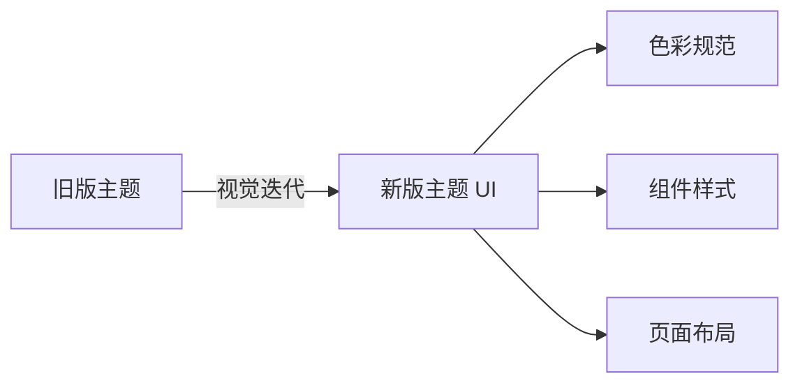
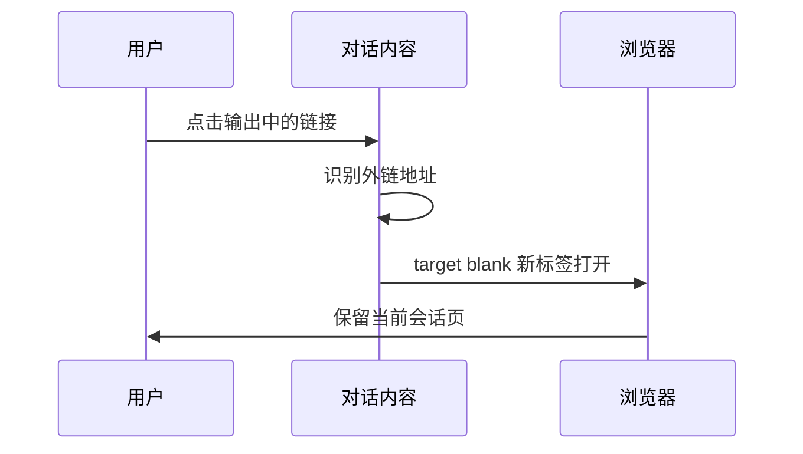
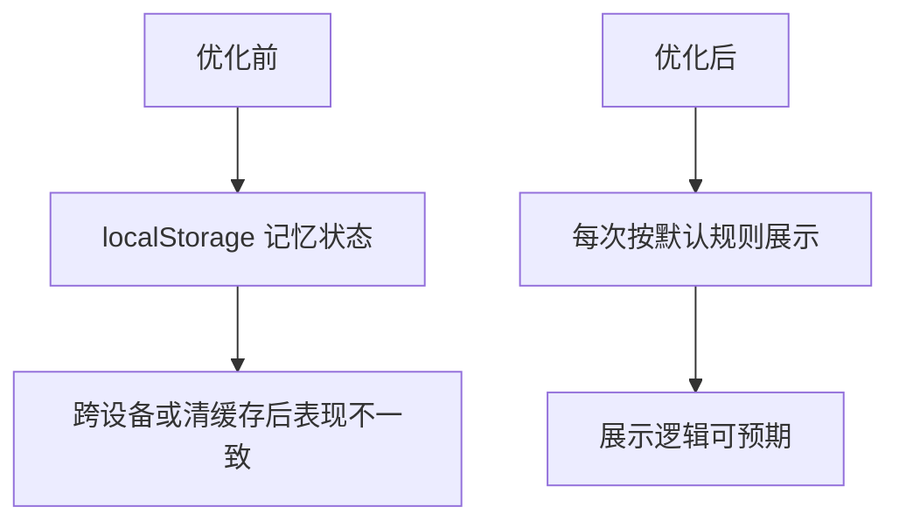
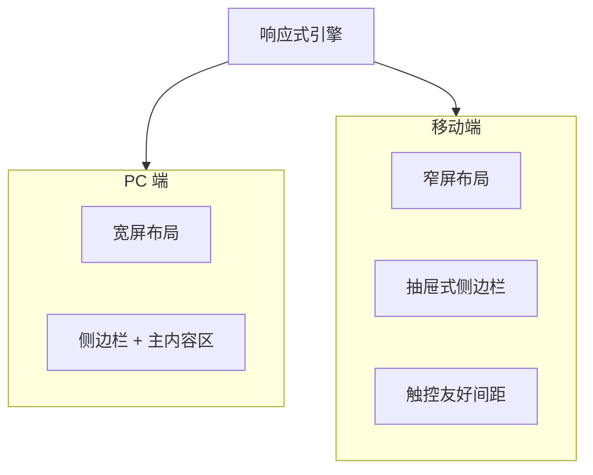
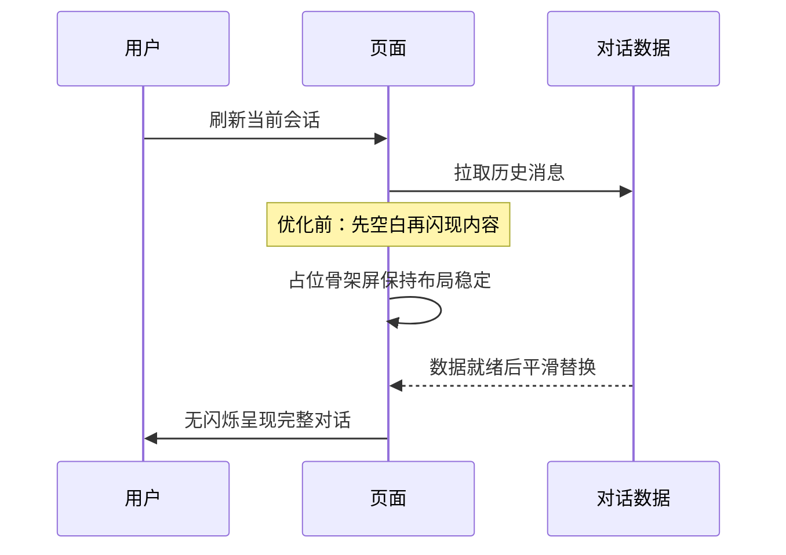
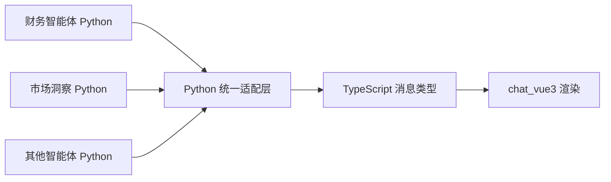
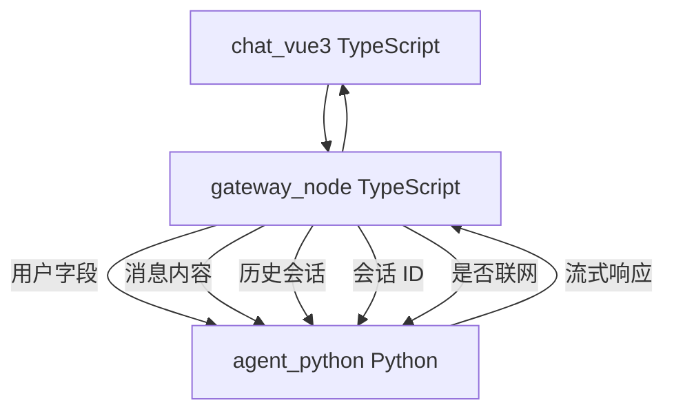
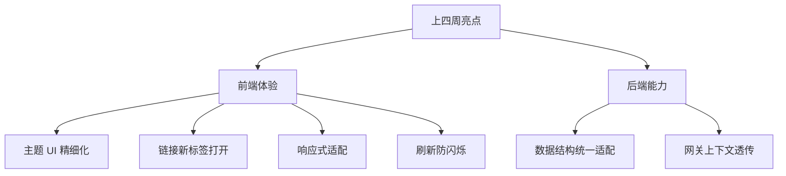

# 工作周报 · 上四周

**周期：** 2026-05-26（周一）~ 2026-06-01（周日）

---

## 本周概览

| 维度 | 关键词 | 技术栈 |
|------|--------|--------|
| 视觉 | 站点主题 UI 精细化 | TypeScript · chat_vue3 |
| 交互 | 链接新标签页打开 | TypeScript |
| 功能 | 侧边栏状态记忆关闭 | TypeScript |
| 适配 | PC 与移动端响应式 | TypeScript · Vue3 |
| 体验 | 对话刷新防闪烁 | TypeScript |
| 后端 | 智能体数据结构统一适配 | Python · agent_python |
| 网关 | 用户与会话上下文透传 | TypeScript · gateway_node |

---

## 1. 界面样式优化

迭代 **chat_vue3（TypeScript + Vue3）** 站点主题 UI 展示效果，精细化视觉呈现，提升整体页面美观度。

**改动要点：**

- 统一色彩、间距、圆角与阴影规范
- 优化组件层级与信息密度
- 强化品牌视觉一致性

> 📷 截图占位：`./images/theme-ui-compare.png`

---

## 2. 交互体验优化

在 TypeScript 消息渲染组件中调整智能体输出内容的 **点击逻辑**，新增 **链接新标签页打开** 功能，优化操作体验。

**收益：** 阅读引用资料时不中断当前对话上下文。

> 📷 截图占位：`./images/link-new-tab.png`

---

## 3. 功能逻辑优化

移除 TypeScript 侧对侧边栏折叠状态的 **localStorage** 读写逻辑，关闭浏览器本地记忆功能，重置默认展示逻辑。

| 项 | 优化前 | 优化后 |
|----|--------|--------|
| 状态存储 | 浏览器 localStorage | 不持久化 |
| 默认行为 | 受历史状态影响 | 统一默认展开/折叠 |

> 📷 截图占位：`./images/sidebar-default.png`

---

## 4. 响应式适配优化

在 TypeScript 响应式布局与 CSS 断点策略基础上，整改 **PC 端、移动端** 适配逻辑，完善多终端浏览兼容性。

**覆盖场景：** 窗口缩放、平板竖屏、手机浏览器、企微内置 WebView。

> 📷 截图占位：`./images/responsive-pc.png`、`./images/responsive-mobile.png`

---

## 5. 加载体验优化

优化 TypeScript 会话页数据加载时序，修复 **对话刷新时内容闪烁** 问题，提升页面加载质感。

> 📷 截图占位：`./images/refresh-no-flash.gif`

---

## 6. 后端对接优化

在 **agent_python（Python / FastAPI）** 侧新增统一适配层，将不同智能体返回结构转换为 **TypeScript 前端** 约定的消息块类型，降低 chat_vue3 分支判断成本。

| 能力 | 说明 |
|------|------|
| Python 入参归一 | 各智能体原始响应格式各异 |
| 结构出参统一 | 映射为前端 TypeScript 接口定义 |
| 扩展性 | 新智能体接入仅需补充 Python 适配规则 |

> 📷 截图占位：`./images/agent-adapter.png`

---

## 7. 后端网关升级

**gateway_node（TypeScript）** 统一将用户信息字段、消息、历史会话、会话 ID、是否联网等透传给 **agent_python（Python）** 下游智能体，已形成固定方案，保障智能体记忆等必要功能。

### 透传字段（固定方案）

| 字段类别 | 作用 |
|----------|------|
| 用户信息 | 身份识别、权限与个性化 |
| 消息 | 当前轮次输入上下文 |
| 历史会话 | 多轮记忆与上下文延续 |
| 会话 ID | 会话级状态绑定 |
| 是否联网 | 控制联网检索类能力开关 |

**架构价值：** 网关层统一透传，下游智能体无需各自解析前端原始请求，记忆与上下文能力稳定可用。

> 📷 截图占位：`./images/gateway-context-pass.png`

---

## 本周亮点总结

---

## 截图归档

| 文件名 | 说明 |
|--------|------|
| `theme-ui-compare.png` | 主题 UI 前后对比 |
| `link-new-tab.png` | 链接新标签打开 |
| `sidebar-default.png` | 侧边栏默认展示 |
| `responsive-pc.png` | PC 端布局 |
| `responsive-mobile.png` | 移动端布局 |
| `refresh-no-flash.gif` | 刷新无闪烁效果 |
| `agent-adapter.png` | 智能体数据适配层 |
| `gateway-context-pass.png` | 网关透传方案 |

---

## 快速链接

- [上三周周报](/reports/2026-06-02/)
- [上两周周报](/reports/2026-06-09/)
- [上一周周报](/reports/2026-06-16/)
