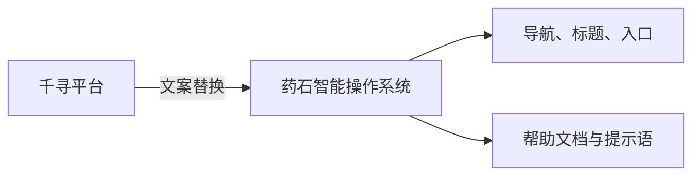
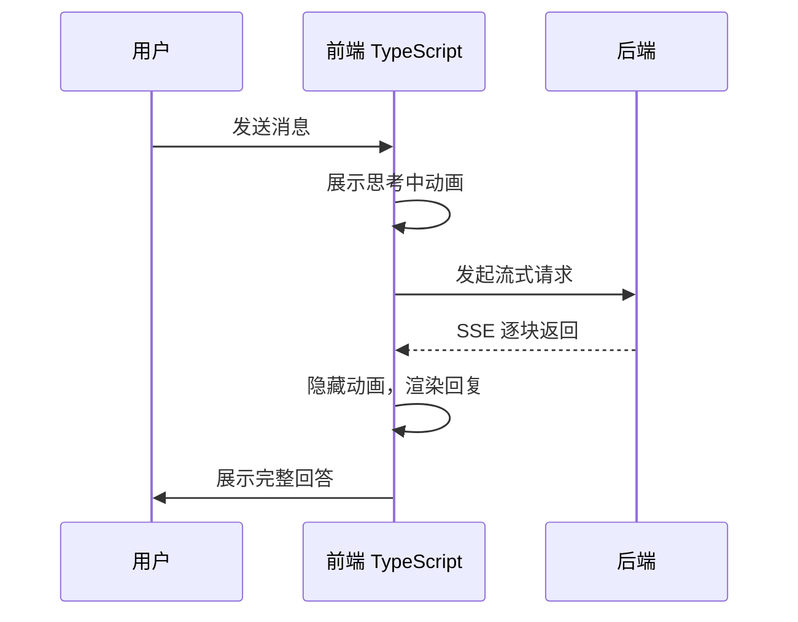
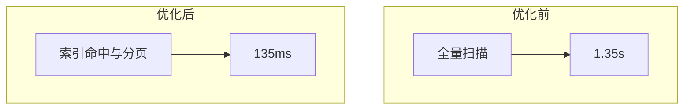
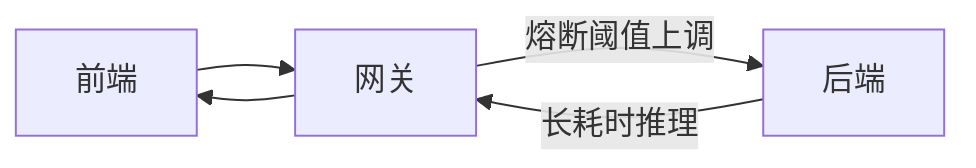
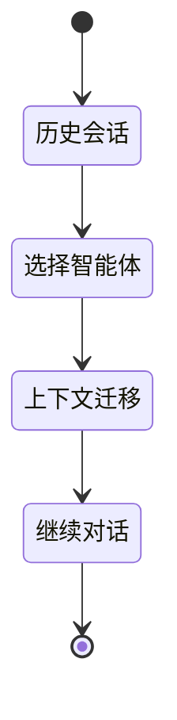

# 工作周报 · 上三周

**周期：** 2026-06-02（周一）~ 2026-06-08（周日）

---

## 本周概览

| 维度 | 关键词 | 技术栈 |
|------|--------|--------|
| 品牌统一 | 千寻 → 药石智能操作系统 | TypeScript |
| 交互体验 | 「正在思考中」加载动画 | TypeScript |
| 性能优化 | 会话列表 1.35s → 135ms | Python |
| 稳定性 | 网关熔断时长调优 | TypeScript |
| 业务打磨 | 历史会话转接智能体 | TypeScript / Python |

---

## 1. 页面文案整改

在 **前端（TypeScript）** 全站完成文案替换，统一更名为 **「药石智能操作系统」**，消除历史品牌残留。

> 📷 截图占位：请将品牌更名前后对比截图放入 `./images/brand-rename.png`

---

## 2. 前端交互优化

在 TypeScript 流式渲染逻辑中优化智能体回复加载，新增 **「正在思考中」** 交互动画，降低用户等待焦虑。

**改动要点：**

- 请求发起即展示加载态，避免空白等待
- 首 token 到达后平滑切换至内容渲染
- 与现有流式输出链路兼容

> 📷 截图占位：`./images/thinking-animation.gif`

---

## 3. API 接口性能提优

在 **后端（Python / FastAPI）** 侧优化会话列表查询接口，通过索引与查询策略调整，接口耗时由 **1.35s 优化至 135ms**，查询效率提升约 **90%**。

| 指标 | 优化前 | 优化后 | 提升 |
|------|--------|--------|------|
| 会话列表 P95 | 1.35s | 135ms | ~90% |

> 📷 截图占位：`./images/session-list-perf.png`

---

## 4. 服务稳定性优化

调大 **网关（TypeScript）** 服务熔断时长，规避超长 Python 智能体推理请求触发熔断导致的服务中断。

**风险场景：** 复杂 RAG / 多轮工具调用导致响应超过原熔断窗口 → 连接被强制断开  
**整改效果：** 延长熔断窗口，与 SSE 长连接策略对齐

---

## 5. 业务功能打磨

优化 TypeScript 前端与 Python 后端协同的 **历史会话转接智能体** 逻辑，修复边界场景下的上下文丢失与智能体切换异常。

> 📷 截图占位：`./images/session-handoff.png`

---

## 截图归档

本周围绕以上五项工作，请在 `images/` 目录补充：

| 文件名 | 说明 |
|--------|------|
| `brand-rename.png` | 品牌更名对比 |
| `thinking-animation.gif` | 思考中动画效果 |
| `session-list-perf.png` | 接口性能对比 |
| `session-handoff.png` | 会话转接功能 |
