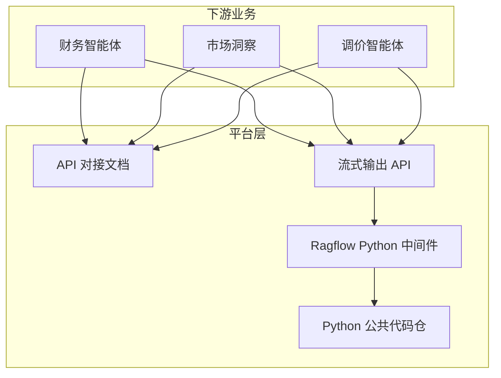
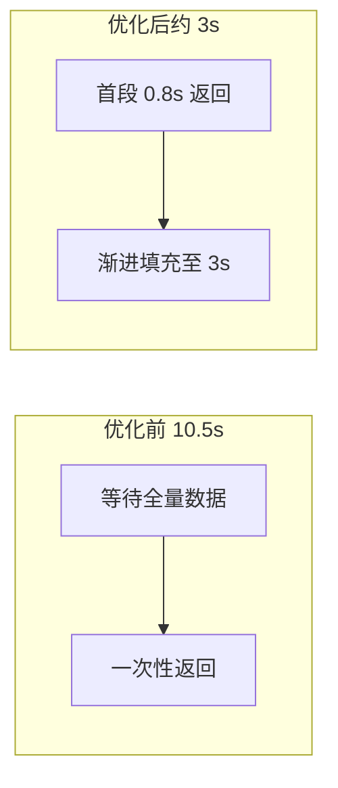
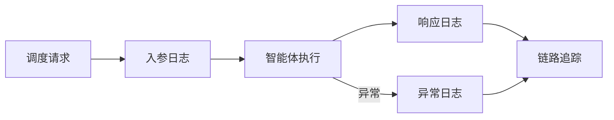
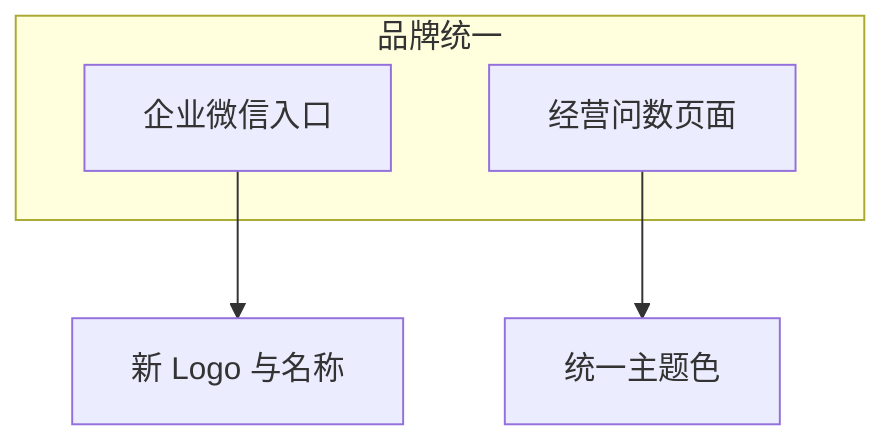
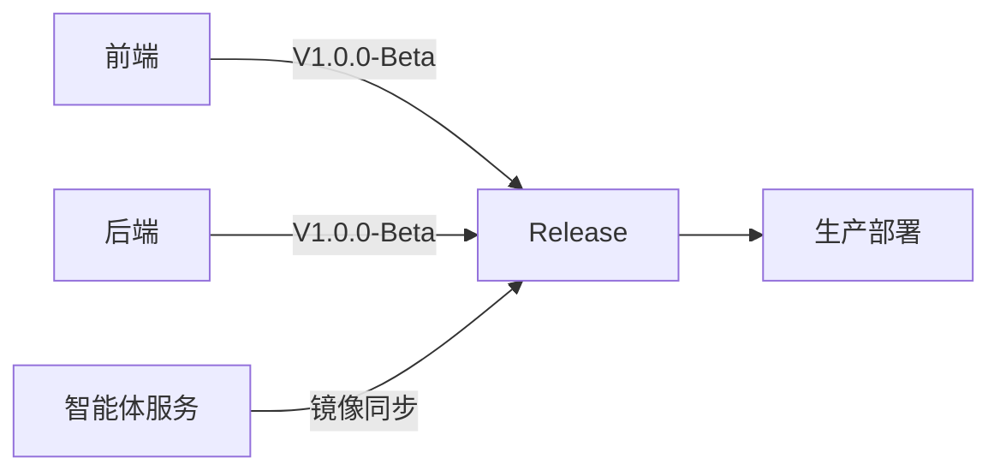

# 工作周报 · 上两周

**周期：** 2026-06-09（周一）~ 2026-06-15（周日）

---

## 本周概览

| 维度 | 关键词 | 技术栈 |
|------|--------|--------|
| 标准化 | 智能体 API 文档、流式 API 设计 | Python / TypeScript |
| 中间件 | Ragflow 文转智答重构 | Python |
| 性能 | 响应 10.5s → 3s | Python |
| 运维 | 调度日志、ACR 镜像版本 | Python |
| 发版 | 千寻 V1.0.0-Beta | TypeScript |

---

## 1. 标准化与 AI 能力建设

### 1.1 智能体 API 对接文档

编写 **智能体 API 对接文档** 供下游团队使用，覆盖 **Python（FastAPI）** 接口规范与 **TypeScript** 客户端调用示例，统一鉴权方式与错误码约定。

### 1.2 流式输出 API 设计

设计 **流式输出 API** 标准，规范 Python 侧 SSE 事件格式与 TypeScript 前端消费协议，明确心跳与断线重连策略。

### 1.3 文转智答（Ragflow 中间件）重构

重构 **后端** 文转智答（Ragflow 中间件）结构，补充 Python 技术文档、搭建公共代码仓，规范团队协作与代码复用。

> 📷 截图占位：`./images/api-doc-preview.png`、`./images/ragflow-arch.png`

---

## 2. 服务性能优化

### 2.1 文转智答渐进式处理

在 **Python** 侧将文转智答改为 **渐进式数据处理**，平均响应时长由 **10.5s 优化至约 3s**，TypeScript 前端可更早渲染首段内容。

| 阶段 | 优化前 | 优化后 |
|------|--------|--------|
| 首字节时间 | 等待全量 | 渐进返回 |
| 平均响应 | 10.5s | ~3s |

### 2.2 静态资源加载策略

优化静态资源加载策略，在 **访问速度** 与 **文件安全** 之间取得平衡（缓存策略、路径隔离、权限校验）。

---

## 3. 运维与稳定性提升

### 3.1 智能体调度日志

在 **后端** 新增智能体调度 **入参、响应、异常** 全链路日志（Python logging），实现问题快速溯源与故障定位。

### 3.2 Docker 镜像版本管理

基于 **阿里云 ACR** 标记 Docker 镜像版本，规范 CI/CD 发布与回滚流程。

| 能力 | 说明 |
|------|------|
| 镜像 Tag | 语义化版本 + Git SHA |
| 仓库 | 阿里云 ACR |
| 收益 | 可追溯、可回滚 |

> 📷 截图占位：`./images/acr-tags.png`、`./images/agent-logs.png`

---

## 4. 体验与品牌优化

- **经营问数**：调整 TypeScript 页面展示逻辑、精简功能、统一主题
- **企业微信入口**：更新名称及 Logo，统一品牌标识

> 📷 截图占位：`./images/wx-entry.png`、`./images/business-qa-ui.png`

---

## 5. Release 项目发版

**千寻** TypeScript 前后端项目同步发版，版本号 **V1.0.0-Beta**。

| 组件 | 版本 | 语言 | 说明 |
|------|------|------|------|
| 前端 | V1.0.0-Beta | TypeScript | 前后端分离 |
| 后端 | V1.0.0-Beta | TypeScript | API 同步发版 |
| 智能体服务 | 同步 | Python | Docker 镜像 ACR 标记 |

> 📷 截图占位：`./images/release-v1-beta.png`

---

## 截图归档

| 文件名 | 说明 |
|--------|------|
| `api-doc-preview.png` | API 文档预览 |
| `ragflow-arch.png` | Ragflow 中间件架构 |
| `acr-tags.png` | ACR 镜像版本 |
| `agent-logs.png` | 调度日志示例 |
| `wx-entry.png` | 企微入口更新 |
| `business-qa-ui.png` | 经营问数界面 |
| `release-v1-beta.png` | 发版记录 |
