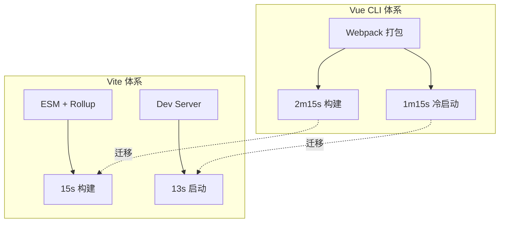
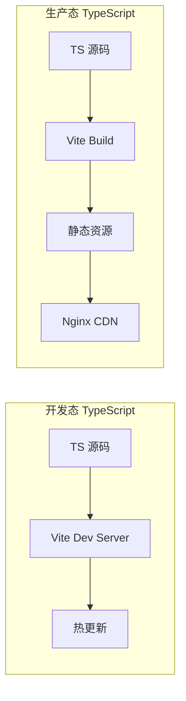
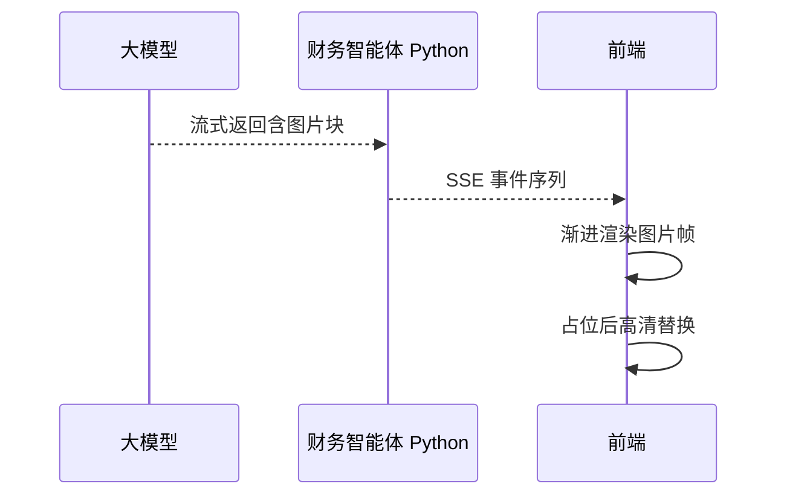
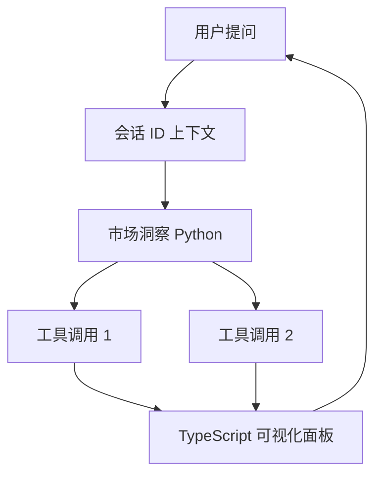
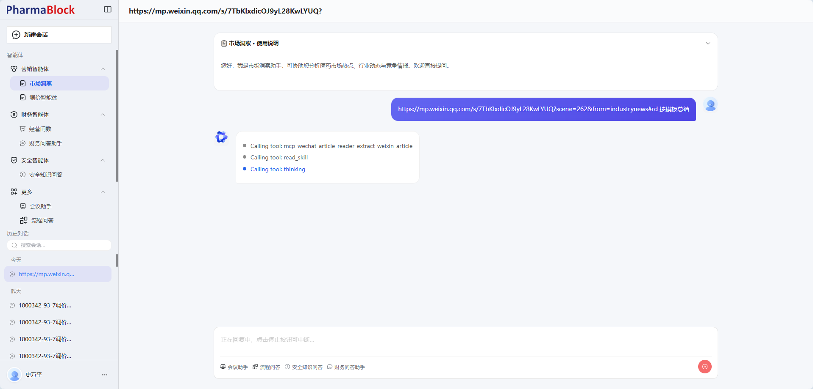
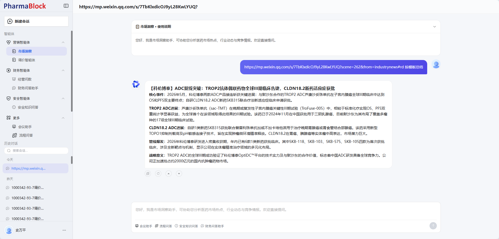
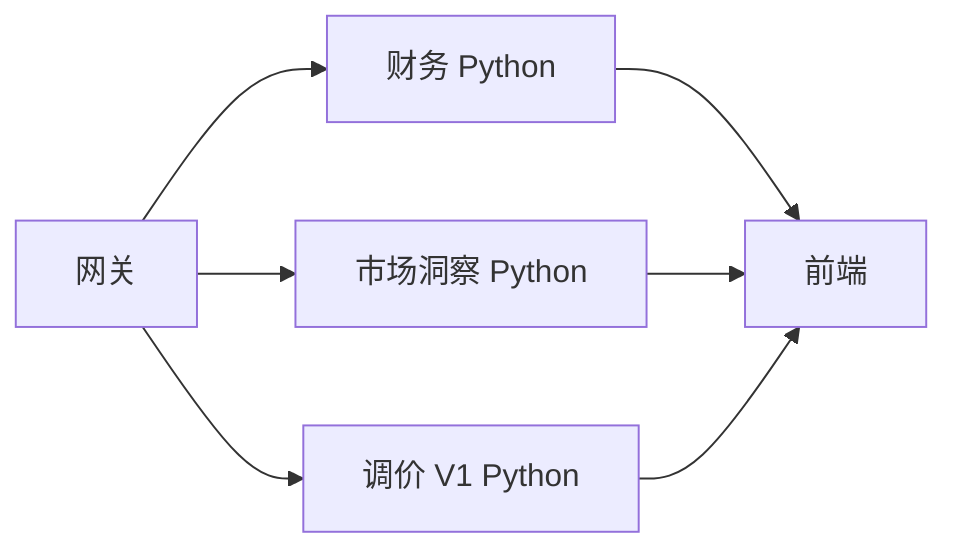
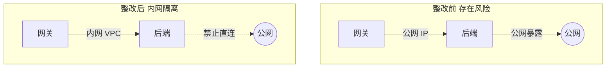
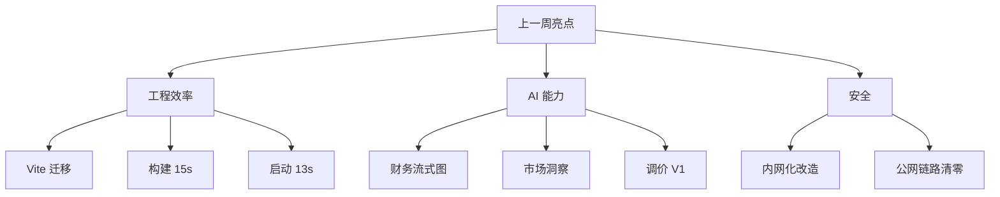

# 工作周报 · 上一周

**周期：** 2026-06-15（周一）~ 2026-06-21（周日）

---

## 本周概览

| 维度 | 关键词 |
|------|--------|
| 工程化 | Vue/CLI → Vite，构建效率 +90% |
| AI 智能体 | 财务 / 市场洞察 / 调价 V1 |
| 安全架构 | 公网 IP → 内网调用 |

---

## 1. Web 前端架构工程升级

完成 **前端（TypeScript）** 底层架构从 **Vue CLI** 迁移至 **Vite** 构建体系，完成工程化底层换代，大幅提升研发与部署效率。

### 性能对比

| 指标 | Vue CLI（优化前） | Vite（优化后） | 提升 |
|------|-------------------|----------------|------|
| 构建速度 | 2分15s | **15s** | ~89% |
| 服务启动 | 1分15s | **13s** | ~83% |
| 综合效率 | — | — | **90%+** |

### 架构变化

**收益：**

- 研发等待成本显著降低，TypeScript 类型检查与 Vite 热更新协同提效
- 与现代前端生态（TypeScript、Vue3 组件库）更好兼容
- 为后续微前端 / 多项目 Monorepo 扩展预留空间

> 📷 截图占位：`./images/vite-build-perf.png`、`./images/vite-dev-startup.png`

---

## 2. 多类 AI 智能体能力工程化落地

持续推进 **后端（Python）** 多业务智能体接入，配合 **前端（TypeScript）** 交互工程优化，拓展平台 AI 业务场景覆盖。

### 2.1 财务智能体 · 流式图片渲染

优化 Python 侧财务智能体 **流式图片渲染逻辑**，TypeScript 前端渐进渲染多媒体块，提升大模型输出展示稳定性。

### 2.2 市场洞察智能体 · 会话记忆与工具可视化

完成市场洞察智能体 **Python 服务** 集成，TypeScript 前端实现工具调用可视化面板：

- 基于 **会话 ID** 的持续记忆能力
- **可视化展示工具调用全过程**，让 AI 推理链路更透明、可追溯

### 效果截图

**工具调用过程可视化 — 微信公众号文章解析与推理链路：**

**结构化总结输出 — 按模板生成行业洞察报告：**

> 📷 左：智能体调用 `mcp_wechat_article_reader`、`read_skill`、`thinking` 等工具的全过程可视化；右：基于微信文章链接按模板输出的结构化市场洞察总结。

### 2.3 调价智能体 V1

完成 **调价智能体 V1（Python）** 工程化接入，保障 TypeScript 前端内容正常、稳定渲染。

| 智能体 | 状态 | 语言 | 核心能力 |
|--------|------|------|----------|
| 财务智能体 | 体验优化 | Python | 流式图片渲染 |
| 市场洞察 | 新接入 | Python | 会话记忆 + 工具链可视化 |
| 调价智能体 | V1 上线 | Python | 稳定内容渲染 |

> 📷 截图占位：`./images/finance-stream-img.png`、`./images/price-agent-v1.png`

---

## 3. 服务器安全架构整改

完成 TypeScript 网关与 Python 智能体服务的安全环境专项排查，将 **所有公网 IP 调用链路** 全面整改为 **内网调用模式**。

### 整改前后对比

### 安全收益

| 项 | 说明 |
|----|------|
| 暴露面 | 消除不必要的公网入口 |
| 隔离性 | 服务间走内网 DNS / 私有 IP |
| 稳定性 | 减少公网抖动对内部链路影响 |
| 合规 | 强化 AI 平台企业级安全能力 |

**整改范围：** 数据库、中间件、第三方 API 回调、服务间 RPC 等全链路排查。

> 📷 截图占位：`./images/security-network-before.png`、`./images/security-network-after.png`

---

## 本周亮点总结

---

## 截图归档

| 文件名 | 说明 |
|--------|------|
| `vite-build-perf.png` | Vite 构建耗时对比 |
| `vite-dev-startup.png` | 开发服务器启动 |
| `finance-stream-img.png` | 财务智能体流式图片 |
| `market-insight-tools.png` | 市场洞察 — 工具调用过程可视化 |
| `market-insight-summary.png` | 市场洞察 — 结构化总结输出 |
| `price-agent-v1.png` | 调价智能体 V1 界面 |
| `security-network-before.png` | 整改前网络拓扑 |
| `security-network-after.png` | 整改后内网架构 |
