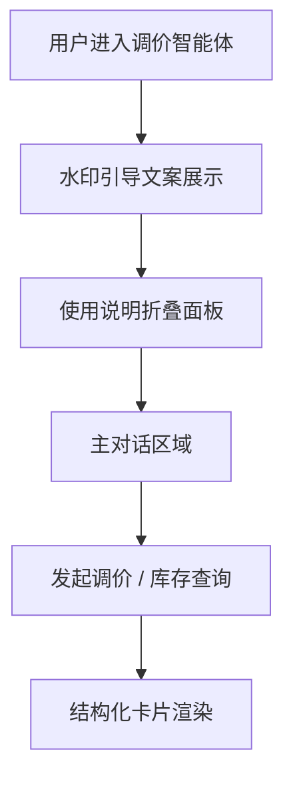
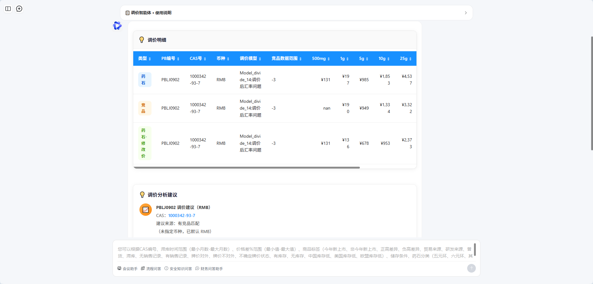
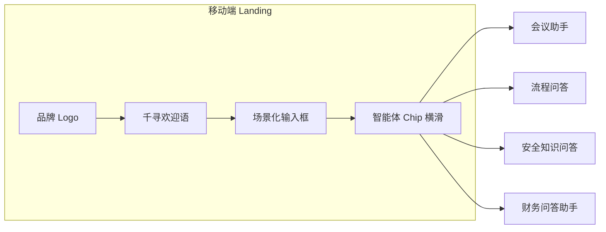
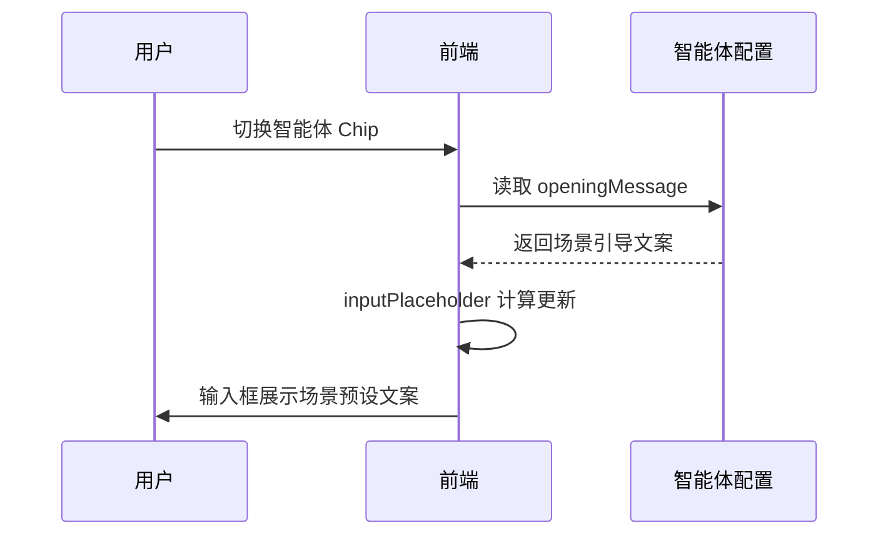
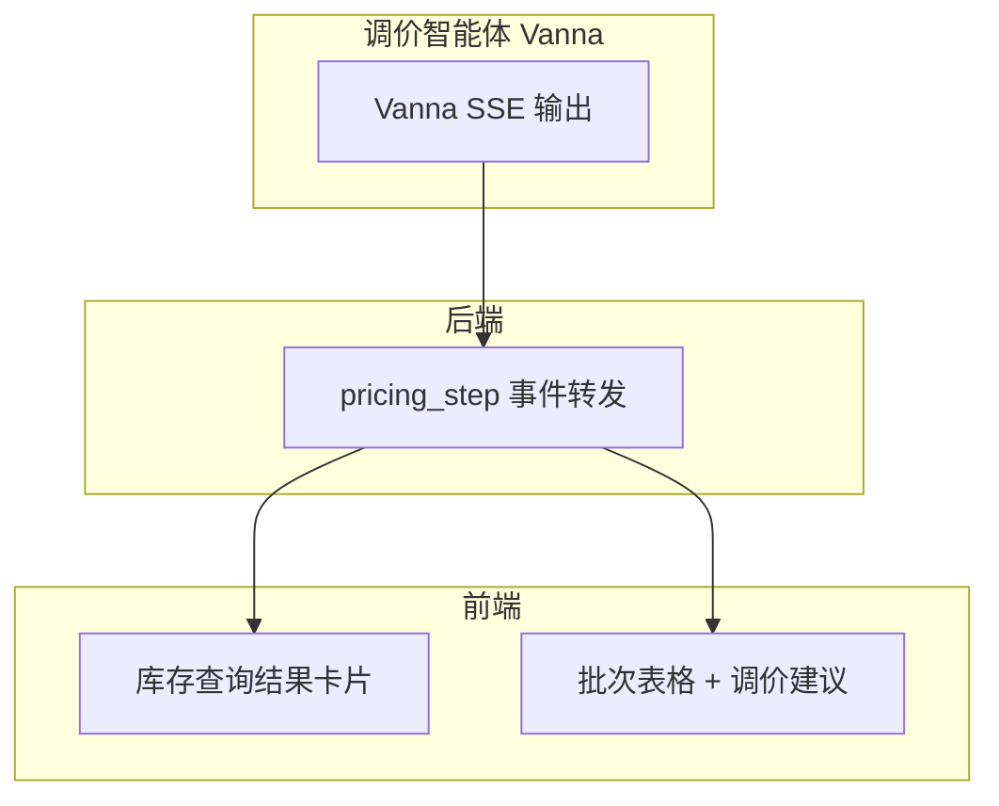
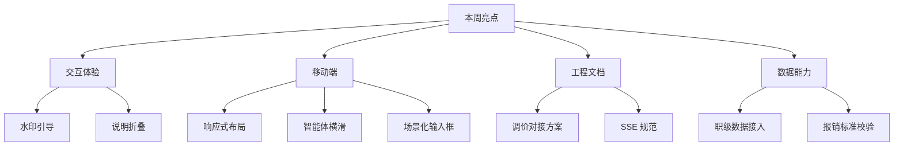

# 工作周报 · 本周

**周期：** 2026-06-22（周一）~ 2026-06-28（周日）

---

## 本周概览

| 维度 | 关键词 | 技术栈 |
|------|--------|--------|
| 交互体验 | 调价智能体水印引导、对话折叠 | TypeScript |
| 移动端 | 响应式布局、智能体锚点滚动 | TypeScript |
| 场景化输入 | 输入框预设文案动态切换 | TypeScript |
| 工程文档 | 调价智能体对接方案、字段规范 | Markdown |
| 数据服务 | 员工职级接入、报销标准校验（**数据由数据部门提供**） | TypeScript / Python |

---

## 1. 调价智能体交互体验优化

优化 **调价智能体（price_adjustment）** 在 **前端（TypeScript）** 中的使用引导与信息展示方式，降低首次使用理解成本。

### 完成内容

- **水印引导文案**：完善智能体 `openingMessage` 使用说明，以浅色引导文案呈现操作要点，帮助用户快速理解调价查询流程
- **对话窗口折叠展示**：基于 `el-collapse` 实现「使用说明」可折叠面板，支持 `pinUsageInstructionsAtHeader` 配置将说明固定于会话头部或嵌入消息区，避免长文案占据主对话空间
- **场景切换联动**：切换智能体时自动清空会话上下文并刷新输入区，保证调价场景下的交互一致性

| 能力 | 说明 |
|------|------|
| 引导文案 | `openingMessage` 配置驱动，首屏与输入区同步展示 |
| 折叠面板 | 默认展开，用户可收起以降低视觉干扰 |
| 头部固定 | `pinUsageInstructionsAtHeader` 支持长说明置顶 |

### 效果截图

> 📷 调价智能体界面：顶部「使用说明」可折叠展示，调价明细与竞品对比表格清晰呈现，底部输入框随场景切换预设引导文案。

---

## 2. 移动端 UI 响应式升级

完成 **前端** 移动端适配专项优化，针对小屏设备重构间距、字号与智能体快捷入口交互，显著提升移动端操作流畅度。

### 完成内容

- **布局与字号**：`@media (max-width: 900px / 640px)` 分层适配，标题 18px → 16px、输入框 15px、智能体 Chip 11px，兼顾可读性与信息密度
- **间距优化**：Landing 区、输入卡片、消息区、安全区内边距按移动端重新收敛，卡片圆角 16px、阴影轻量化
- **智能体锚点滚动**：底部智能体快捷入口支持横向滑动（`overflow-x: auto` + `-webkit-overflow-scrolling: touch`），选中项高亮，四类专业智能体（会议 / 流程 / 安全 / 财务）均可流畅切换

### 效果截图

**智能体快捷入口横滑（3 项可见）：**

**完整四智能体入口展示：**

| 优化项 | 移动端策略 |
|--------|------------|
| 标题区 | 纵向堆叠 Logo + 文案，居中换行 |
| 输入卡片 | 圆角卡片 + 底部操作栏分区 |
| 智能体 Chip | `flex-shrink: 0` 横滑，隐藏滚动条 |
| 安全区 | `env(safe-area-inset-*)` 适配刘海屏 |

---

## 3. 对话输入框动态适配

优化对话输入框 **场景化预设文案** 能力，输入框 `placeholder` 随当前智能体 `openingMessage` 自动切换，提升不同业务场景下的交互规范性。

### 实现逻辑

| 场景 | 预设文案来源 | 效果 |
|------|--------------|------|
| 默认千寻 | 固定「给千寻发消息」 | 通用对话入口 |
| 会议助手 | `openingMessage` 会议场景说明 | 引导会议纪要操作 |
| 流程问答 | 流程知识库引导文案 | 规范流程类提问 |
| 安全 / 财务 | 各智能体独立引导 | 场景化交互一致性 |

**技术要点：** `inputPlaceholder` 计算属性优先取 `openingMessage`，Landing 页与对话页输入框共用同一逻辑；切换智能体时同步清空输入并调整 `textarea` 高度。

---

## 4. 工程设计文档沉淀

完成 **调价智能体与千寻平台对接方案** 文档输出，标准化字段设计与交互落地规范，为后续后端转发与前端卡片渲染提供协议基线。

### 文档产出

| 文档 | 归属 | 内容 |
|------|------|------|
| 调价智能体输出渲染对接文档 | 前端 | 结构化 SSE 事件、四区块卡片 UI、字段枚举 |
| SSE 对接规范 | 后端 | 流式事件格式、网关转发约定 |

### 协议要点

- **智能体标识**：`agent_id = price_adjustment`
- **目标 UI**：结果摘要 → 基础库存概览 → 详细批次信息 → 智能调价策略建议
- **字段规范**：`casNo`、`tags`、`inventoryAge`、`priceSuggestion` 等列 key 与渲染样式一一对应
- **流式顺序**：约定 `pricing_step` SSE 事件序列，类比经营问数 `analytics_step`

> 📷 截图：`./images/price-agent-doc-preview.png`（待补充文档预览）

---

## 5. 员工职级数据接入

::: warning 📌 数据来源
**本节涉及的员工职级、报销标准等业务数据均由数据部门统一提供与维护。**
:::

完成 **北森（Beisen）员工职级数据** 接入（**数据由数据部门提供**），支撑财务智能体报销标准按职级精准校验，夯实平台数据服务能力。

### 数据链路

### 核心字段

> **📌 以下字段数据均由数据部门提供与维护。**

| 字段 | 说明 | 业务用途 |
|------|------|----------|
| `jobLevelOid` | 职级 OId | 唯一标识 |
| `jobLevelName` | 职级名称 | 展示与规则匹配 |
| `accountCode` | 员工账号 | 与用户上下文关联 |

**业务价值：** 财务问答助手可依据员工职级查询住宿费标准、报销限额等规则（如「住宿费标准（不同职级、地区）」快捷提问），实现报销合规校验的数据底座。

> 📷 截图：`./images/beisen-job-level-sync.png`（待补充职级同步界面）

---

## 本周亮点总结

---

## 截图归档

| 文件名 | 说明 |
|--------|------|
| `image.png` | 调价智能体 — 使用说明折叠、调价明细与输入引导 |
| `img.png` | 移动端智能体横滑入口（3 项可见） |
| `img_1.png` | 移动端完整四智能体入口展示 |
| `price-agent-doc-preview.png` | 调价对接文档预览（待补充） |
| `beisen-job-level-sync.png` | 北森职级数据同步（待补充） |

---

## 快速链接

- [上一周周报](/reports/2026-06-15/)
- [上两周周报](/reports/2026-06-08/)
