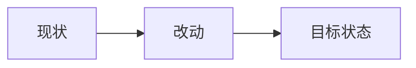

# 工作周报 · 本周

**周期：** 2026-06-23（周一）~ 2026-06-29（周日）

---

::: info 待补充
本周工作内容尚未录入。请在下方编辑本页，或将截图放入 `./images/` 目录后更新对应章节。
:::

## 工作项模板

复制以下结构填写本周进展：

### 1. （工作主题）

**背景：**  
**完成内容：**  
**成果 / 指标：**

> 📷 截图：`./images/example.png`

---

## 截图归档

| 文件名 | 说明 |
|--------|------|
| _(待添加)_ | |

---

## 快速链接

- [上一周周报](/reports/2026-06-16/)
- [上两周周报](/reports/2026-06-09/)
- [上三周周报](/reports/2026-06-02/)
