# 2026 年 6 月度工作总结

**周期：** 2026-06-01 ~ 2026-06-30  
**平台：** 药石智能操作系统（千寻）

---

本月围绕 **底座架构升级、多业务智能体工程落地、全链路性能优化、系统安全与运维标准化、文档体系沉淀** 五大维度开展全栈研发工作，兼顾前端体验迭代、底层工程改造、数据能力接入与线上稳定性治理。

## 月度概览

| 维度 | 关键词 | 关联周报 |
|------|--------|----------|
| 工程底座 | Vue/CLI → Vite，构建效率 +90% | [06-15](/reports/2026-06-15/) |
| 品牌统一 | 药石智能操作系统、企微入口 | [06-01](/reports/2026-06-01/) |
| 智能体落地 | 调价 / 市场洞察 / 财务 / 经营问数 | [06-15](/reports/2026-06-15/) · [06-22](/reports/2026-06-22/) |
| 性能治理 | 会话列表 135ms、RAG 3s、静态资源 | [06-01](/reports/2026-06-01/) · [06-08](/reports/2026-06-08/) |
| 安全运维 | 内网化、熔断、日志、ACR、V1.0.0-Beta | [06-08](/reports/2026-06-08/) · [06-15](/reports/2026-06-15/) |
| 标准沉淀 | API 文档、流式规范、调价对接方案 | [06-08](/reports/2026-06-08/) · [06-22](/reports/2026-06-22/) |
| 数据服务 | 员工职级接入、报销标准校验 | [06-22](/reports/2026-06-22/) |

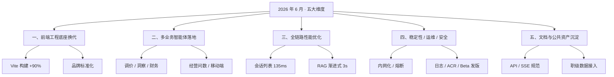

---

## 一、前端底层架构全面换代，研发构建效率大幅提升

完成 **前端（TypeScript）** 从 Vue CLI 迁移至 **Vite** 全新构建体系，实现工程底层升级；同步完成平台品牌标准化整改。

### 1.1 构建性能对比

| 指标 | 优化前（Vue CLI） | 优化后（Vite） | 提升 |
|------|-------------------|----------------|------|
| 项目构建 | 2 分 15 秒 | **15 秒** | ~89% |
| 本地服务启动 | 1 分 15 秒 | **13 秒** | ~83% |
| 综合效率 | — | — | **90%+** |

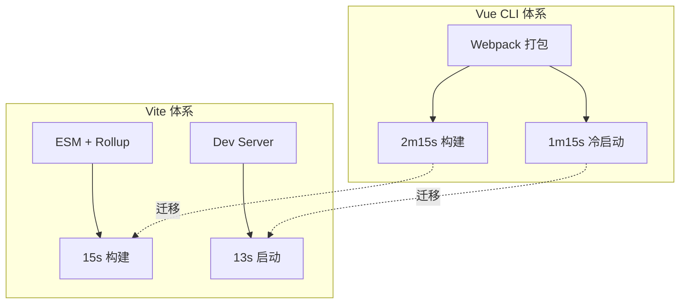

**收益：** 显著缩短本地调试与迭代交付等待周期，为后续 Monorepo / 多前端工程扩展预留空间。

> 详见 [06-15 周报 · Web 前端架构工程升级](/reports/2026-06-15/#_1-web-前端架构工程升级)

### 1.2 品牌标准化

- 全域文案统一替换为 **「药石智能操作系统」**
- 更新企业微信入口名称与 Logo，统一产品品牌视觉标识

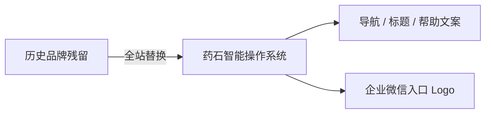

> 详见 [06-01 周报 · 页面文案整改](/reports/2026-06-01/#_1-页面文案整改)

---

## 二、多业务智能体工程化落地，交互体验持续精细化

持续推进 **后端（Python）** 多业务智能体接入，配合 **前端（TypeScript）** 交互工程优化，拓展平台 AI 业务场景覆盖。

### 2.1 多类智能体接入

| 智能体 | 状态 | 核心能力 |
|--------|------|----------|
| 调价智能体 V1 | 上线 | 结构化卡片渲染、库存与调价建议 |
| 市场洞察 | 新接入 | 会话 ID 记忆、工具调用链路可视化 |
| 财务智能体 | 体验优化 | 流式图片渐进渲染 |
| 经营问数 | 页面优化 | 多节点合并展示、明亮代码主题 |

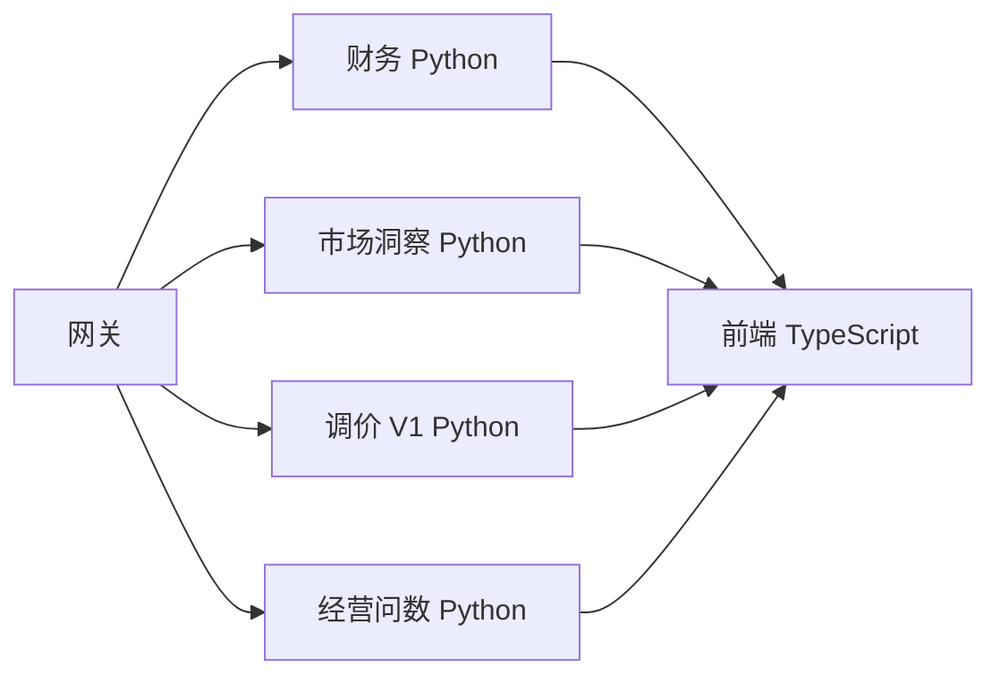

**市场洞察 — 工具调用可视化：**

**市场洞察 — 结构化总结输出：**

> 详见 [06-15 周报 · 多类 AI 智能体能力工程化落地](/reports/2026-06-15/#_2-多类-ai-智能体能力工程化落地)

### 2.2 通用交互能力优化

- 新增智能体 **「正在思考中」** 加载动画，降低首包等待焦虑
- 改造对话输入框，支持跟随不同智能体 **自动切换场景预设文案**
- 优化历史会话 **跨智能体转接逻辑**，提升会话流转流畅度

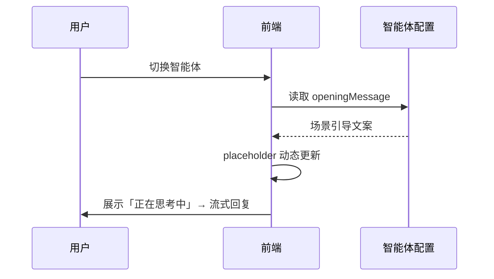

> 详见 [06-01 周报](/reports/2026-06-01/) · [06-22 周报 · 对话输入框动态适配](/reports/2026-06-22/#_3-对话输入框动态适配)

### 2.3 调价智能体专项体验打磨

- 新增 **水印引导操作文案**，对话面板支持 **折叠收起**
- 完成全站 **移动端响应式 UI** 升级，统一字号与间距规范
- 新增智能体 **锚点横滑滚动** 交互，改善移动端操作手感

> 详见 [06-22 周报](/reports/2026-06-22/)

### 2.4 经营问数页面优化

- 重构消息 **多节点内容合并展示** 逻辑
- 下线冗余 SQL 切换、条数选择控件
- 统一页面 **代码块明亮主题**，优化数据阅览体验

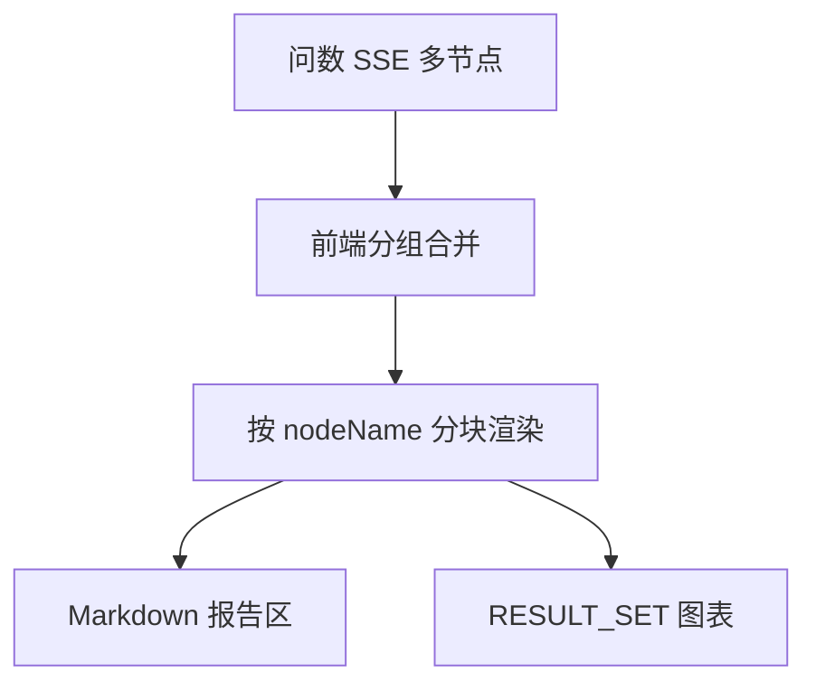

> 详见 [06-08 周报 · 体验与品牌优化](/reports/2026-06-08/#_4-体验与品牌优化)

---

## 三、全链路性能专项治理，多项核心接口量化降耗时

### 3.1 核心指标

| 优化项 | 优化前 | 优化后 | 提升 | 链路 |
|--------|--------|--------|------|------|
| 会话列表查询 | 1.35s | **135ms** | ~90% | 后端 Python |
| 文转智答 RAG | 10.5s（阻塞） | **~3s**（渐进） | ~71% | 后端 Python + 前端 |
| 前端构建 | 2m15s | **15s** | ~89% | 前端 TypeScript |
| 本地启动 | 1m15s | **13s** | ~83% | 前端 TypeScript |

### 3.2 文转智答渐进式处理

将 **后端** 文转智答中间件由全量阻塞改为 **渐进式分片处理**，前端可更早渲染首段内容。

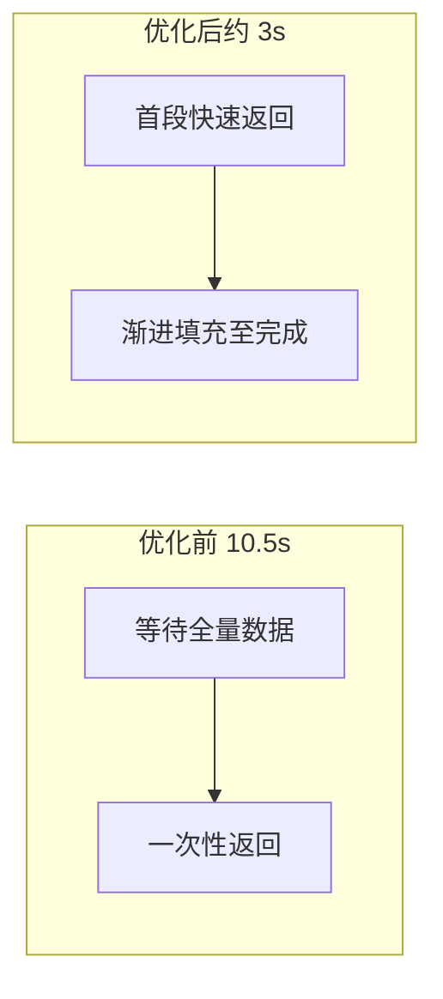

### 3.3 静态资源与渲染优化

- 采用 **本地备份 + 反向代理** 统一静态资源管控，兼顾加载速度与访问安全
- 优化大模型 **长文本、图表、图片** 渐进渲染逻辑，缓解卡顿

> 详见 [06-01 周报 · API 接口性能提优](/reports/2026-06-01/#_3-api-接口性能提优) · [06-08 周报 · 服务性能优化](/reports/2026-06-08/#_2-服务性能优化)

---

## 四、服务稳定性、运维与安全体系建设

### 4.1 高可用与可观测

| 能力 | 说明 |
|------|------|
| 网关熔断调优 | 调整熔断时长，规避超长 AI 请求触发服务中断 |
| 调度全链路日志 | 入参、返回、异常全量记录，线上故障快速溯源 |

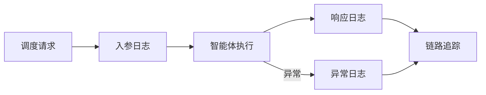

### 4.2 版本发布标准化

- 依托 **阿里云 ACR** 完成 Docker 镜像版本标记与归档管理
- 完成 **药石智能操作系统 V1.0.0-Beta** 前后端同步发版

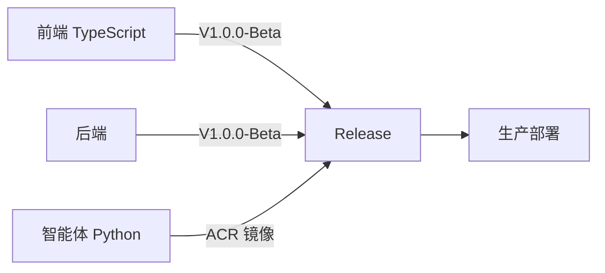

### 4.3 服务器安全架构整改

全面清除 **公网 IP 调用链路**，全部切换 **内网访问**，消除公网暴露风险。

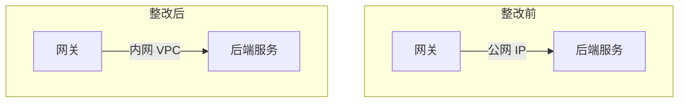

| 安全收益 | 说明 |
|----------|------|
| 暴露面 | 消除不必要公网入口 |
| 隔离性 | 服务间走内网 DNS / 私有 IP |
| 合规 | 强化企业级 AI 平台安全能力 |

> 详见 [06-08 周报 · 运维与稳定性](/reports/2026-06-08/#_3-运维与稳定性提升) · [06-15 周报 · 安全架构整改](/reports/2026-06-15/#_3-服务器安全架构整改)

---

## 五、标准化文档、公共工程资产沉淀，赋能团队协同

### 5.1 官方对接规范文档

| 文档 | 归属 | 内容 |
|------|------|------|
| 智能体 HTTP API 对接文档 | 后端 | 接口规范、鉴权、错误码 |
| 流式输出 API 设计 | 后端 + 前端 | SSE 事件格式、心跳与断线策略 |
| 调价智能体对接设计文档 | 前端 + 后端 | 字段定义、卡片 UI、`pricing_step` 事件 |

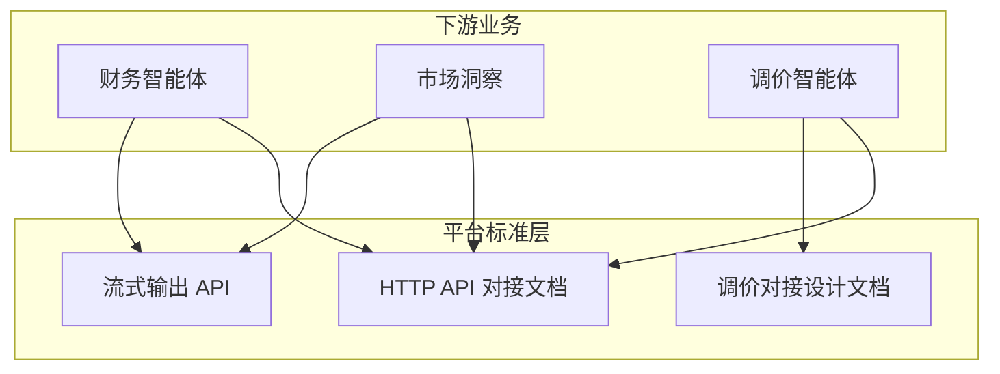

### 5.2 公共工程资产

- 重构 **文转智答中间件** 项目目录结构，补齐配套说明文档
- 搭建 **公共代码仓库**，抽离通用 AI 工具与渲染组件，统一开发规范，支撑多人并行协作

### 5.3 第三方数据打通

::: warning 📌 数据来源
**本节涉及的员工职级、报销标准等业务数据均由数据部门统一提供与维护。**
:::

完成 **员工职级基础数据** 接入（**数据由数据部门提供**），支撑财务智能体按职级自动校验报销标准。

| 字段 | 说明 | 业务用途 |
|------|------|----------|
| `jobLevelOid` | 职级 OId | 唯一标识 |
| `jobLevelName` | 职级名称 | 规则匹配与展示 |
| `accountCode` | 员工账号 | 与用户上下文关联 |

> 详见 [06-22 周报 · 员工职级数据接入](/reports/2026-06-22/#_5-员工职级数据接入)

---

## 月度整体价值

本月完成平台 **前端工程底座换代**、**多业务 AI 智能体规模化落地**，通过量化性能优化、内网安全改造、日志与版本运维体系搭建，同步沉淀全套智能体对接标准与公共代码资产；兼顾 PC 端、移动端全场景交互打磨，实现平台从 **功能可用** 向 **高性能、高安全、标准化、易维护** 的企业级 AI 操作系统升级，为后续智能体批量接入与长期迭代提供完善工程支撑。

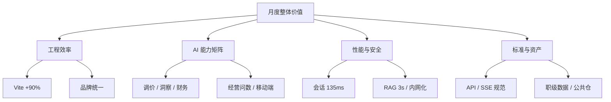

---

## 周报索引（6 月）

| 周期 | 范围 | 链接 |
|------|------|------|
| 第 1 周 | 06-01 ~ 06-07 | [上三周](/reports/2026-06-01/) |
| 第 2 周 | 06-08 ~ 06-14 | [上两周](/reports/2026-06-08/) |
| 第 3 周 | 06-15 ~ 06-21 | [上一周](/reports/2026-06-15/) |
| 第 4 周 | 06-22 ~ 06-28 | [本周](/reports/2026-06-22/) |

---

## 截图归档

月报复用各周 `images/` 素材，新增截图请放入 `reports/monthly/2026-06/images/`。

| 来源 | 文件名 | 说明 |
|------|--------|------|
| 06-15 | `market-insight-tools.png` | 市场洞察工具调用可视化 |
| 06-15 | `market-insight-summary.png` | 市场洞察结构化总结 |
| 06-22 | `image.png` | 调价智能体折叠引导 |
| 06-22 | `img.png` | 移动端智能体横滑 |
